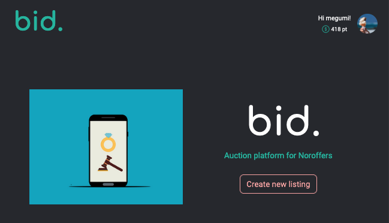

# bid. Auction Site

https://auction.kimuramegumi.site/



## Brief

bid. is an auction platform where users can post a listing for auction and bid on other users's listings.
Only the registered users can bid and create listings, while unregistered users can also search through the listings.
The site's target audience is Noroff students community.

## Built With

- HTML
- CSS
- SASS
- JS
- Bootstrap

## Getting Started

### Installing

1. Clone the repo:

```bash
git clone https://github.com/MegumiKim/SP2.git
```

2. install dependencies

```bash
npm i
```

### Running

```bash
npm run build
```

### JSDocs

```bash
npm run docs
```

Run index.html in /out folder with liveserver.

## Project Planning

Github Project:
https://github.com/users/MegumiKim/projects/2/views/1

Adobe XD:
https://xd.adobe.com/view/2ca4cf01-6e1d-4aaf-9d8d-4cd26039b789-79f7/

## Contact

Any issues / feedback, reach me on kimuramegumi@gmail.com
